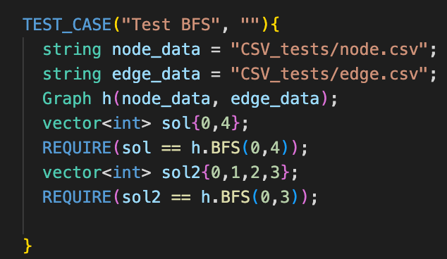

# CS225 Final Project Written Report

The main goal of the project was to map San Francisco and find the shortest distance between the two nodes. We are achieving this goal with the help of the following three algorithms - BFS, Dijkstra’s algorithm, and Bresenham’s algorithm. The output was given in the PNG form to show what nodes were used to get from node A to node B. Also we have the added functionality of finding the shortest between between two nodes passing through n particular landmarks.

# Descriptions of the algorithms used:

# 1.BFS
BFS between two nodes on a weighted graph returns the path with the least amount of turns or minimum edges taken
## The Output
In our implementation, the BFS is very similar to dijikstra’s algorithm for nodes that are closer together because there are limited options for the path taken.

Correctnesss/Testing:
Tested for almost all edge cases namely, when the shorter path is at a greater distance, when the longer path is at a shorter distance and when the input is out of bounds. Also tested for the case of merging paths to reach the destination node.

All three test cases are used to test BFS on the graph depicted beside it.

# 2.Dijkstra’s algorithm

 The Dijkstra’s algorithm is used to find the shortest path between two given nodes. If the two nodes are pretty close then we have a zoom in feature which displays a zoomed in version of the path on the top-right of the image. 
 
 ## The Output
 
 The first image is a typical dijkstra's output between two given points. The second image is another type output which is displayed when the two given nodes are close to each other.
 

 
 Correctness/Testing:
 Tested for almost all edge cases namely, when the shorter path is at a greater distance, when the longer path is at a shorter distance and when the input is out of bounds. Also tested for the case of merging paths to reach the destination node.
 
 Images - 
 
 
 
 
 
 
 # 3.Bresenham's algorithm
 
 Bresenham’s Algorithm is used to draw a line between two points. Bresenham’s itself only works for drawing lines in the positive x-direction (left to right) and positive y-direction (bottom to top).

Since a PNG considers positive y-direction as top to bottom, we implemented Bresenham’s in the opposite y-direction. We also had to implement Bresenham’s for the -x-direction and -y-direction. This was done by creating a separate condition that checks for the -x-direction and applying Bresenham’s x-direction logic inversely. Same goes for the -y-direction.

## The Output

The output successfully draws a green line from one red node to another.

 
 Images - 
 
 Correctness/Testing:
 
 Made a function testDrawConnections that keeps track of the pixels that are colored.
drawConnection will also store the colored pixels in a vector for testing purposes.
 

Image - 
 
 Used to test the function drawConnection on two nodes whose slope is between 0 and 1.
 
Image - 
 
  Used to test the function drawConnection on two nodes whose slope is between -1 and 0.
 
 TestCase3:

 Image - 
 
Used to test the function drawConnection on two nodes whose slope is greater than 1.

 TestCase4:

 Image - 
 
 Used to test the function drawConnection on two nodes whose slope is less than -1.

Overall, our project was able to establish the goal of finding the shortest path between two given nodes and through n user provided landmarks with the help of the three algorithms mentioned above. 
The BFS algorithm helped us find the path which required the least number of edges, while the Dijkstra's algorithm helped us find the shortest distance path between two nodes and also the shortest distance through n landmarks.
The Bresenhams algorithm helped us visualize these two algorithms by drawing a line between two nodes on the map of San Francisco.

 
